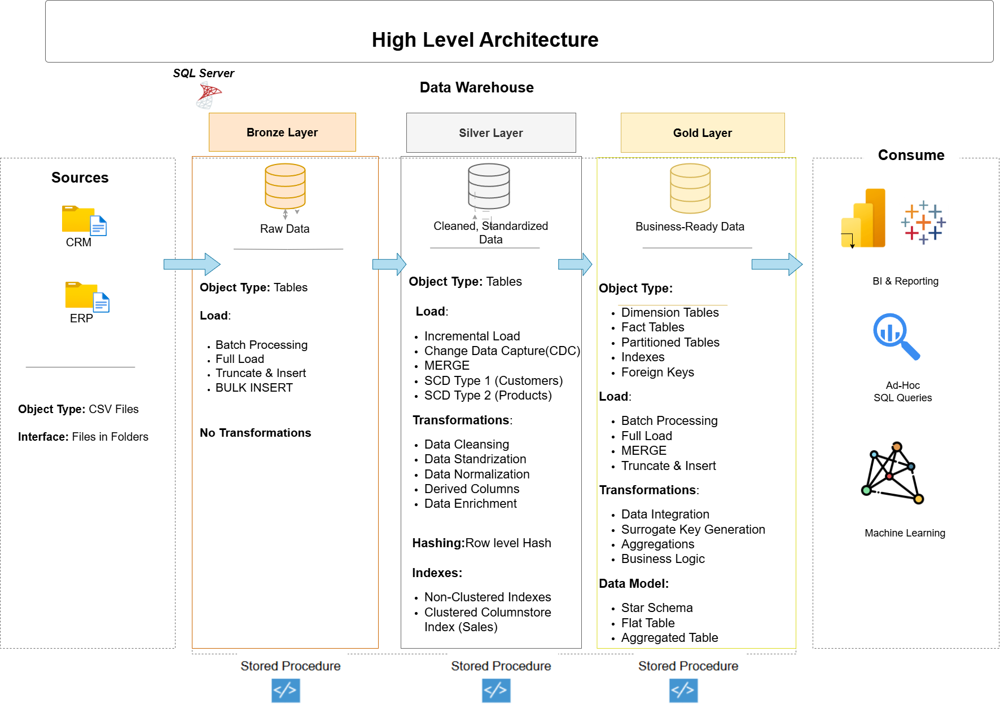
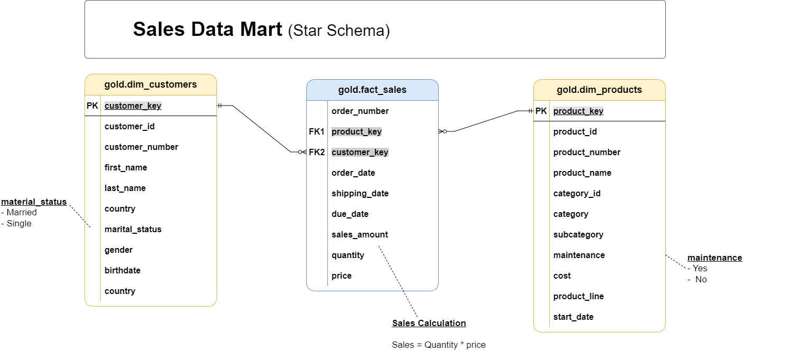

#  Enterprise SQL Data Warehouse And Analytics Project         
      
### Medallion Architecture | Metadata-Driven ETL | Slowly Changing Dimensions 1 and 2 | Change Data Capture | Data Governance | Star Schema
---    
     
## Overview       
 
This project is an end-to-end **Data Warehouse solution** built using **Microsoft SQL Server**.
  
Data is extracted from **CRM and ERP source systems (CSV extracts)**, processing **116K+ records across 6 source systems**, and transformed through a structured **Medallion architecture (Bronze → Silver → Gold)** using **Stored Procedures**.

The system performs **ETL (Extract, Transform, Load)**, applies Data Cleaning and Data Quality Checks, builds a **Star Schema model**, and supports **Advanced SQL Analytics**. A centralized **Audit & Governance** framework ensures data is tracked, monitored, and reliable.

---

## Problems Solved

- **Fragmented data from multiple business systems:** Integrated CRM and ERP datasets into a centralized SQL data warehouse.

- **Poor data quality in raw operational data:** Implemented data cleaning, validation checks, and standardization during Silver layer transformations.

- **Difficulty tracking data changes and history:** Applied SCD Type-1 and Type-2 techniques to manage updates and maintain historical records.

- **Inefficient full data reloads:** Implemented incremental loading using a watermark framework and change detection with HASHBYTES.

- **Lack of governance and monitoring in ETL pipelines:** Built an audit framework to track ETL runs, detect data quality issues, and log pipeline execution.

- **Slow analytical queries on transactional data:** Designed a star schema with partitioning and columnstore indexing for faster analytics.
.
 --- 

### Core Capabilities

* Incremental Loading (Watermark Framework)
* SCD Type 1 and SCD Type 2
* HASHBYTES (SHA2_256) Change Detection
* Metadata-Driven ETL
* Partitioning & Clustered Columnstore Index
* Audit Logging & Data Quality Validation
* Master ETL Orchestration


##  Data Architecture

The data architecture for this project follows Medallion Architecture **Bronze**, **Silver**, and **Gold** layers:


---

## Project Structure

```

Enterprise-Data-Warehouse/
│
├── docs/                             # Documentation, architecture & source CSV files
│   ├── data_architecture.png
│   ├── data_flow.png
│   ├── data_integration.png
│   ├── data_model.png
│   ├── data_catalog.md
│   ├── naming_conventions.md
│   └── *.csv                         # CRM & ERP source extracts
│
├── scripts/                          # Core SQL Implementation (folders numbered in run order)
│   │
│   ├── 01_database/                  # Database & schema creation
│   │   └── init_database.sql
│   │
│   ├── 02_audit/                     # Audit & ETL control framework
│   │   ├── ddl_audit.sql             # Creates audit tables (schema comes from init_database.sql)
│   │   └── seed_etl_config.sql       # Populates audit.etl_config (single source of ETL metadata)
│   │
│   ├── 03_bronze/                    # Bronze layer (Raw ingestion)
│   │   ├── ddl_bronze.sql
│   │   └── proc_load_bronze.sql
│   │
│   ├── 04_silver/                    # Silver layer (Cleaning & transformation)
│   │   ├── ddl_silver.sql
│   │   ├── proc_load_metadata_driven.sql
│   │   └── proc_load_silver.sql
│   │
│   ├── 05_gold/                      # Gold layer (Star schema & reporting)
│   │   ├── ddl_gold.sql
│   │   └── proc_load_gold.sql
│   │
│   ├── 06_orchestration/             # Master ETL orchestration
│   │   └── init_load_all.sql
│   │
│   ├── 07_security/                  # Security & Access Control (RBAC)
│   │   └── ddl_security.sql
│   │
│   └── 08_data_analytics/            # Analytical SQL on the Gold layer (reports & insights)
│       ├── 01_database_exploration.sql        # Tables, schemas & column metadata
│       ├── 02_dimensions_exploration.sql      # Unique countries, categories, products
│       ├── 03_date_range_exploration.sql      # First/last order date, customer age range
│       ├── 04_measures_exploration.sql        # Key business metrics (sales, orders, customers)
│       ├── 05_magnitude_analysis.sql          # Totals by country, gender, category, customer
│       ├── 06_ranking_analysis.sql            # Top/bottom products & customers
│       ├── 07_change_over_time_analysis.sql   # Monthly/yearly sales trends
│       ├── 08_cumulative_analysis.sql         # Running totals & moving averages
│       ├── 09_performance_analysis.sql        # Year-over-year & vs-average product performance
│       ├── 10_data_segmentation.sql           # Product cost ranges, VIP/Regular/New customers
│       ├── 11_part_to_whole_analysis.sql      # Category share of total sales
│       ├── 12_report_customers.sql            # Customer report view (gold.report_customers)
│       └── 13_report_products.sql             # Product report view (gold.report_products)
│
├── tests/                            # Validation & test scripts
│   ├── quality_checks_silver.sql
│   └── quality_checks_gold.sql
│
├── .gitignore
└── README.md

```

### Data Model


---

# ETL Workflow

## 1️. Bronze Layer – Raw Data Collection

**Source:** CRM and ERP CSV files
**Stored Procedure:** `bronze.load_bronze`

### What Happens Here

* BULK INSERT loads raw data
* Tables truncated before load
* Stores the data exactly as received (no changes)
* Batch ID generated for tracking
* Saves details of each load for record keeping in `audit.etl_log`
* TRY–CATCH error handling

### Data Quality – Bronze

* Tracks every data load using a Batch ID
* Logs errors during loading
* Prevents incomplete or partial data loads
* Data loads can be tracked for audit and monitoring

---

## 2️. Silver Layer – Data Cleaning & Transformation

**Stored Procedures:**

* `silver.load_silver`
* `silver.load_metadata_driven`

### Data Cleaning Performed

* **Duplicate Removal** (e.g., keep latest record using `ROW_NUMBER()`)
* **Missing Value Handling** (e.g., NULL customer_id flagged)
* **Code Standardization** (e.g., M → Male)
* **Invalid Date Correction** (e.g., wrong date set to NULL)
* **Revenue Validation** (e.g., Sales = Quantity × Price recalculated)
* **ID Cleanup** (e.g., remove extra spaces in customer_id)
* **Country Standardization** (e.g., USA → United States)
* **Data Format Consistency** (e.g., consistent date format YYYY-MM-DD)

### Data Quality – Silver

* Row Count Validation
* Mandatory Field Checks
* Revenue Match Check (Quantity × Price)
* Date Validation
* New Data Load Control (Incremental / Watermark)
* Duplicate Record Check
* Data Issue Logging & Tracking(`audit.data_quality_issues`)

### SCD & Load Logic

**Customers – SCD Type 1**

* MERGE statement
* Data Change Identification (HASHBYTES)
* Load Only New Data (Incremental Watermark)

**Products – SCD Type 2**

* Historical Data Tracking (Effective & Expiry Dates
* Current Record Indicator (is_current Flag)

**Sales – Delta Load**

* Load Only New Records (Watermark Filtering)
* Faster Query Performance (Clustered Columnstore)

**Metadata-Driven ERP Load**

* Table details stored in audit.etl_config
* Queries run dynamically (sp_executesql)
* Full Load (Truncate & Insert)
* 
---

## 3️. Gold Layer – Reporting & Star Schema Model

**Stored Procedure:** `gold.load_gold`

### Star Schema Design

**Dimension Tables**

* `gold.dim_customers`
* `gold.dim_products`
* Surrogate Keys
* Unknown Member Handling (-1)

**Fact Table**

* `gold.fact_sales`
* Partitioned by Year
* Clustered Primary Key
* Foreign Key Constraints
* Business intelligence-Optimized Structure

### Data Quality – Gold

* Referential Integrity Enforcement
* Foreign Key Validation
* Unknown Key Mapping (-1)
* Data partitions verified

---

## Enterprise Security (Gold Layer)

The Gold layer implements database-level security using SQL Server features:

**Role-Based Access Control (RBAC)** Users are assigned roles (gold_analyst, gold_manager). Permissions are given to roles, not directly to users.

**Row-Level Security (RLS)** Users can only see sales data for the countries they are allowed to access.

**Dynamic Data Masking** The sales_amount column is hidden (masked) for analysts. Managers can see the real values.

**Data Classification & Auditing** ensitive customer data is labeled, and data access activity is tracked.

Security is enforced at the database level, ensuring controlled, production-ready access to reporting data.


---

## 4️.Data Analytics & Business Reporting

Advanced SQL analysis performed on Gold layer data using **aggregations, window functions, ranking, trend analysis, and segmentation**:

All scripts are in `scripts/08_data_analytics/` and are meant to be run in order (01 → 13).

| # | Analysis | What it answers | Key SQL techniques |
|---|----------|-----------------|--------------------|
| 01 | **Database Exploration** | Which tables and schemas exist, and what columns does each table have? | `INFORMATION_SCHEMA.TABLES`, `INFORMATION_SCHEMA.COLUMNS` |
| 02 | **Dimensions Exploration** | Which countries do customers come from? What categories, subcategories and products exist? | `DISTINCT`, `ORDER BY` |
| 03 | **Date Range Exploration** | What are the first and last order dates, how many months of data exist, and who are the youngest and oldest customers? | `MIN()`, `MAX()`, `DATEDIFF()` |
| 04 | **Measures Exploration** | Total sales, items sold, average price, number of orders, products and customers, combined into one key-metrics report | `SUM()`, `AVG()`, `COUNT()`, `UNION ALL` |
| 05 | **Magnitude Analysis** | Customers by country and gender, products and average cost by category, revenue by category and by customer, items sold by country | `GROUP BY`, aggregate functions |
| 06 | **Ranking Analysis** | Top 5 and bottom 5 products by revenue, top 10 customers by revenue, 3 customers with the fewest orders | `TOP`, `RANK() OVER()` window function |
| 07 | **Change Over Time Analysis** | How do sales, customers and quantity change month by month and year by year? | `YEAR()`, `MONTH()`, `DATETRUNC()`, `FORMAT()` |
| 08 | **Cumulative Analysis** | Running total of sales and moving average of price over time | `SUM() OVER()`, `AVG() OVER()` |
| 09 | **Performance Analysis** | Yearly product sales compared with the product's own average and with the previous year (above/below average, increase/decrease) | CTEs, `LAG()`, `AVG() OVER (PARTITION BY)`, `CASE` |
| 10 | **Data Segmentation** | Products grouped into cost ranges; customers grouped into **VIP**, **Regular** and **New** by spending and lifespan | `CASE`, CTEs, `GROUP BY` |
| 11 | **Part-to-Whole Analysis** | Which product categories contribute the most to overall sales (% of total)? | `SUM() OVER()`, percentage calculation |
| 12 | **Customer Report** (`gold.report_customers` view) | One row per customer: age group, segment, total orders, sales, quantity, products, lifespan, recency, average order value, average monthly spend | `CREATE VIEW`, CTEs, `CASE`, `DATEDIFF()` |
| 13 | **Product Report** (`gold.report_products` view) | One row per product: revenue segment (High-Performer / Mid-Range / Low-Performer), total orders, sales, quantity, unique customers, lifespan, recency, average order revenue, average monthly revenue | `CREATE VIEW`, CTEs, `CASE`, `DATEDIFF()` |

---

# Audit & Control Framework

Schema: `audit`

* `audit.etl_log`
* `audit.watermark_thresholds`
* `audit.data_quality_issues`
* `audit.etl_config`
* Immediate ETL stop using THROW if critical errors happen

---

# Master ETL Execution

**Stored Procedure:** `init.load_all`

* Batch Initialization
* Configuration Validation
* Bronze → Silver → Gold Execution
* Success/Failure Logging
* Controlled End-to-End ETL Pipeline

---

## How to Run

Run the scripts in this order:

1. `scripts/01_database/init_database.sql` – creates the database and all schemas (`bronze`, `silver`, `gold`, `audit`, `init`)
2. `scripts/02_audit/ddl_audit.sql` – creates the audit tables and seeds the watermarks
3. `scripts/02_audit/seed_etl_config.sql` – populates `audit.etl_config` (required; `init.load_all` aborts without it)
4. `scripts/03_bronze/ddl_bronze.sql`, `scripts/04_silver/ddl_silver.sql`, `scripts/05_gold/ddl_gold.sql` – layer tables
5. Stored procedures: `scripts/03_bronze/proc_load_bronze.sql`, `scripts/04_silver/proc_load_metadata_driven.sql`, `scripts/04_silver/proc_load_silver.sql`, `scripts/05_gold/proc_load_gold.sql`, `scripts/06_orchestration/init_load_all.sql`
6. (Optional) `scripts/07_security/ddl_security.sql`
7. Execute the master ETL procedure:
   **EXEC init.load_all;**
8. (Optional) Run `tests/quality_checks_silver.sql` and `tests/quality_checks_gold.sql` for independent validation
9. (Optional) Run the analysis scripts in `scripts/08_data_analytics/` (01 → 13)


---

**Author**: Utkarsh Reddy Nathala

**Linkedin**: https://www.linkedin.com/in/utkarshreddynathala/

**Contact**: utkarshnathala@gmail.com , 8977011784
